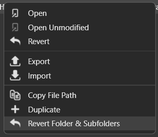
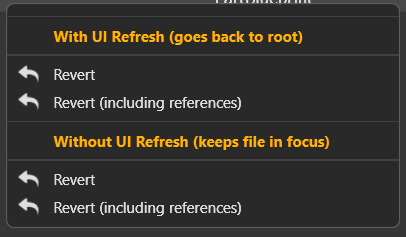

# RevertFolderPlugin

A [Frosty Editor (J-Lyt's Dragon Age Veilguard branch)](https://github.com/J-Lyt/FrostyToolsuite) plugin for reverting a whole folder and all of it's subfolders. Works for 1.0.7.0 and probably higher.

## Features

- Reverting a whole folder and all subfolders
- Option to revert all linked references (like PartBlueprints)
- Option to keep the focus on the reverted files or the default behaviour (going back to root if there are no more files in the reverted folder)

## Installation

Download the plugin from the [DA:Veilguard Modding Discord server](https://discord.gg/pKF9ReTdAh) (Frosty DEV -> plugins) and copy the RevertFolderPlugin.dll to Frosty Editor\Plugins.

## Compiling

In order to compile this code yourself you have to copy the files to FrostyToolsuite\Plugins\RevertFolderPlugin. The RevertFolderPlugin.sln should be visible in this folder.